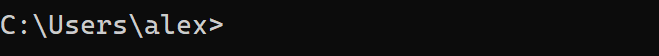

### Hi there 👋
This is my GitHub Readme-Section.

### 🌱 Currenty Activities
I am currently learning Basic HTML, CSS and JavaScript as well as git. Also i am trying a little python and powershell. As Code Editor i am working with VS Code.

My projects are mainly learning projects, no productive code. So i would be happy about suggestions for improvement.
Looking forward to your issue.

### Values
- Optimism / Positive Mindset
- Curiosity
- Technology enthusiasm

### Topics
💻🔑📈

### Verification
Public Key:
				`0x4a460732530796d5`

### Profiles
Furthermore, i am always looking for new opportunities to engage in topics related to things of my interest fields:
- Gaming (Board-Games and Computer Games), [Wordle](https://www.nytimes.com/games/wordle/index.html) or [Heardle](https://www.heardle.app/)
- Home-Automation
- Biking & Hiking

See also my Profiles on [Thingiverse](http://www.bit.ly/alos-things) and [500px](https://500px.com/p/alexandero?view=photos).

<!--
**alos-source/alos-source** is a ✨ _special_ ✨ repository because its `README.md` (this file) appears on your GitHub profile.

Here are some ideas to get you started:

- 🔭 I’m currently working on ...
- 🌱 I’m currently learning ...
- 👯 I’m looking to collaborate on ...
- 🤔 I’m looking for help with ...
- 💬 Ask me about ...
- 📫 How to reach me: ...
- 😄 Pronouns: ...
- ⚡ Fun fact: ...
-->
